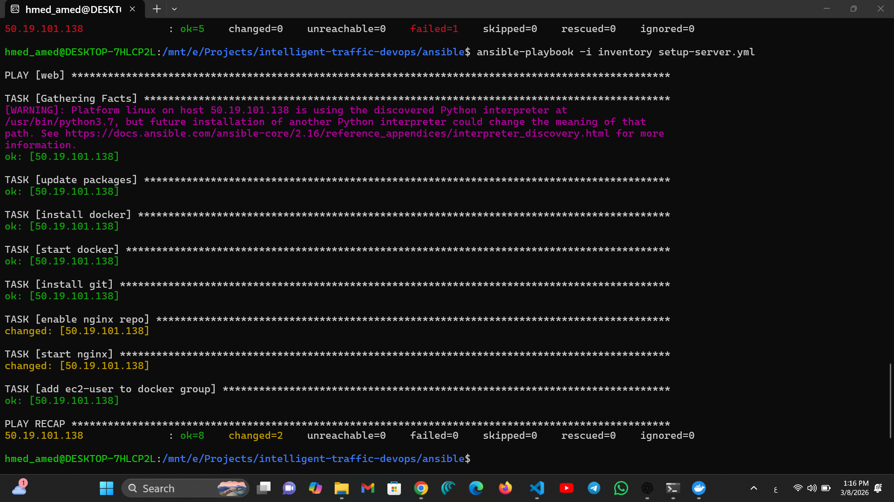
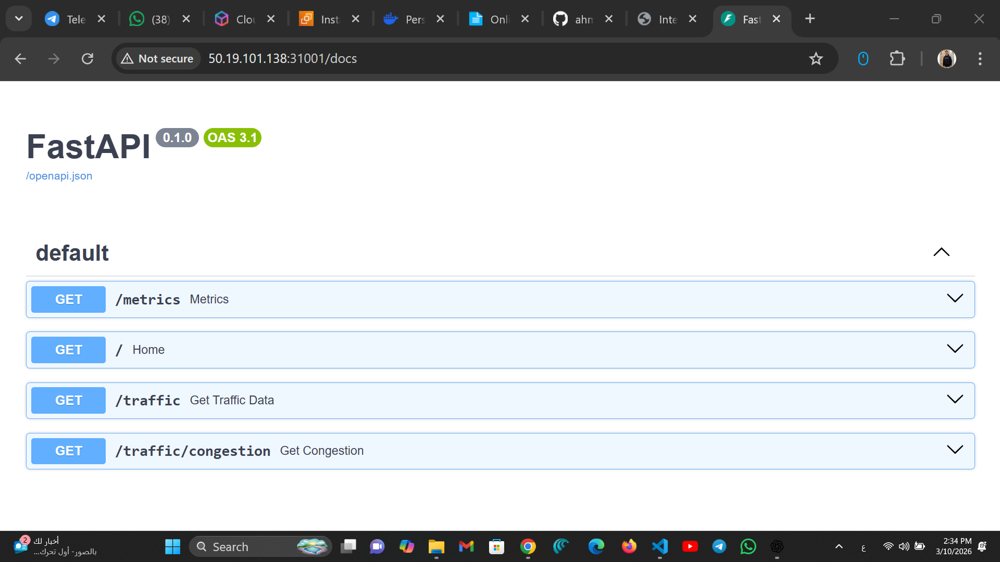
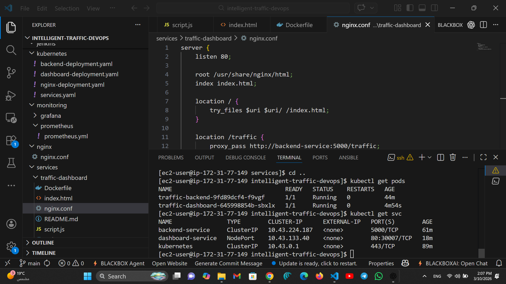

# 🚦 Intelligent Traffic Management DevOps Project

A complete **DevOps-based traffic monitoring platform** that simulates traffic sensor data, processes it through backend services, and visualizes system and traffic metrics in real time.

This project demonstrates **end-to-end DevOps practices** including infrastructure provisioning, containerization, CI/CD pipelines, Kubernetes deployment, and monitoring.

---

# 🏗️ System Architecture

The following diagram shows the overall architecture of the system.


The workflow of the project:

Developer → GitHub → Jenkins CI/CD → Docker → Kubernetes → Monitoring (Prometheus & Grafana)

---

# ⚙️ Technologies Used

| Category | Tools |
|--------|------|
| Containerization | Docker |
| Orchestration | Kubernetes |
| CI/CD | Jenkins |
| Infrastructure as Code | Terraform |
| Configuration Management | Ansible |
| Monitoring | Prometheus & Grafana |
| Cloud | AWS EC2 |
| Backend | FastAPI |
| Reverse Proxy | Nginx |
| Version Control | Git & GitHub |

---

# 🚀 Infrastructure Provisioning (Ansible)

Automated server setup and configuration using **Ansible Playbooks**.



Ansible automates:

- Docker installation
- Nginx installation
- Git installation
- Server configuration
- Service enablement

---

# 📊 Traffic Monitoring Dashboard

A real-time dashboard showing traffic congestion statistics and traffic flow analytics.


The dashboard displays:

- Total processed vehicles
- Traffic congestion rate
- Traffic flow analytics
- Traffic trends across locations

---

# 🔗 Backend API (FastAPI)

The backend service is built with **FastAPI** and provides traffic data through REST APIs.



Main endpoints:


---

# 📈 Prometheus Monitoring

Prometheus collects metrics from:

- Traffic API
- EC2 Node Exporter
- System services


Metrics collected include:

- API request metrics
- System resource usage
- Traffic processing metrics

---

# 📉 Grafana Metrics Visualization

Grafana dashboards visualize the metrics collected by Prometheus.


Dashboards include:

- Traffic metrics
- Request monitoring
- Performance analytics

---

# 🖥️ Node Exporter Dashboard

Server monitoring dashboard displaying CPU, memory, and disk usage.



This helps monitor system health and infrastructure performance.

---

# ☸️ Kubernetes Deployment

Application services are deployed using **Kubernetes**.

Deployed services:

- Traffic API
- Traffic Dashboard
- Nginx Reverse Proxy

Example commands:

```bash
kubectl get pods
kubectl get services
