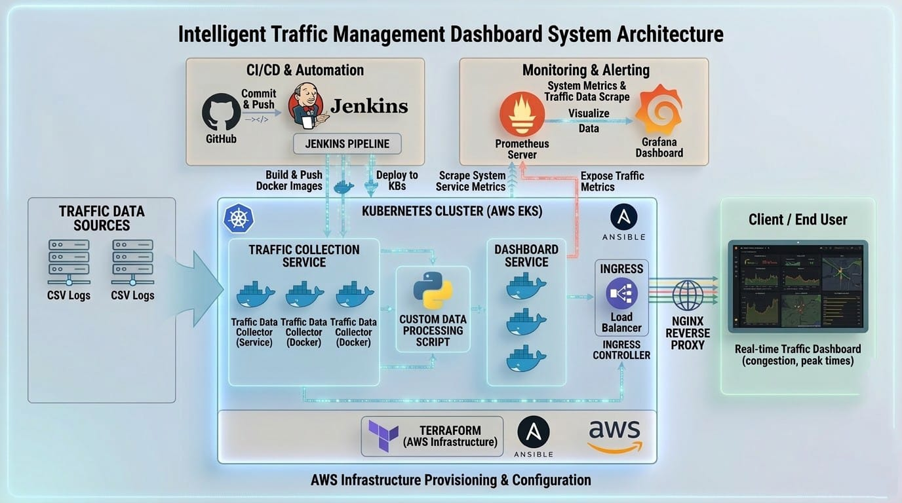
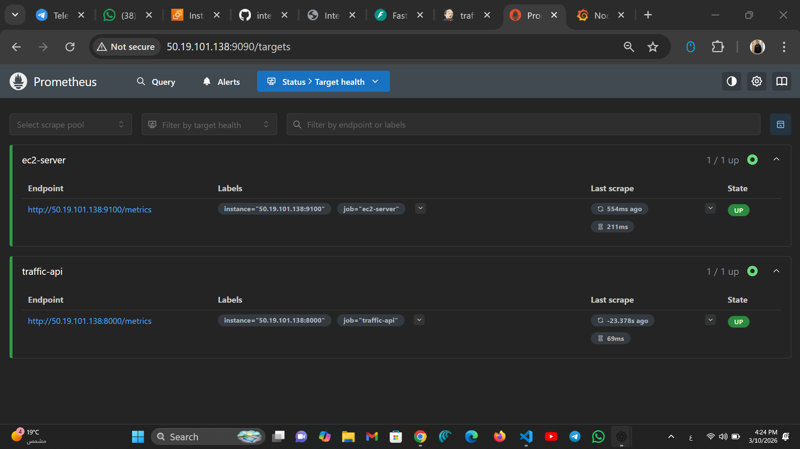
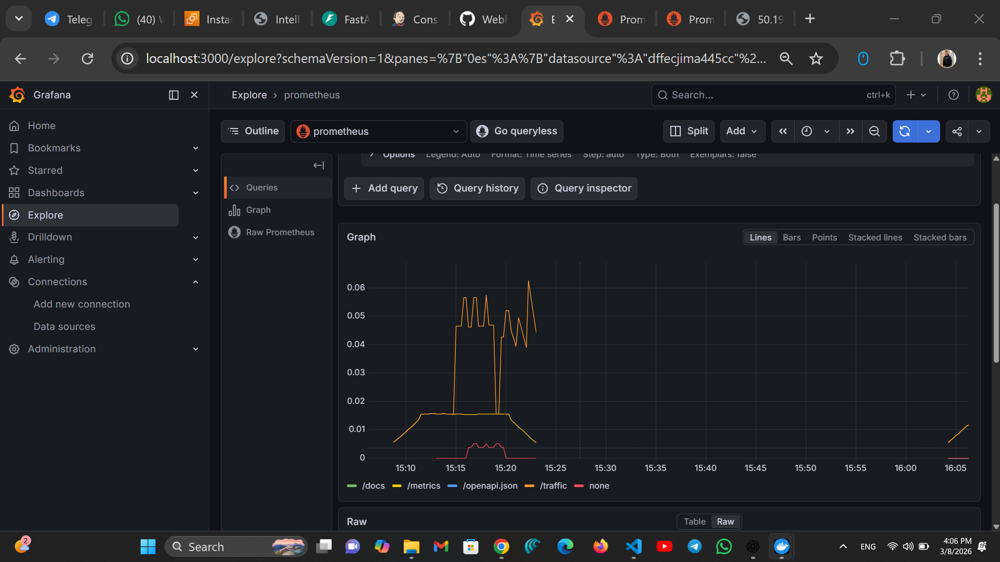
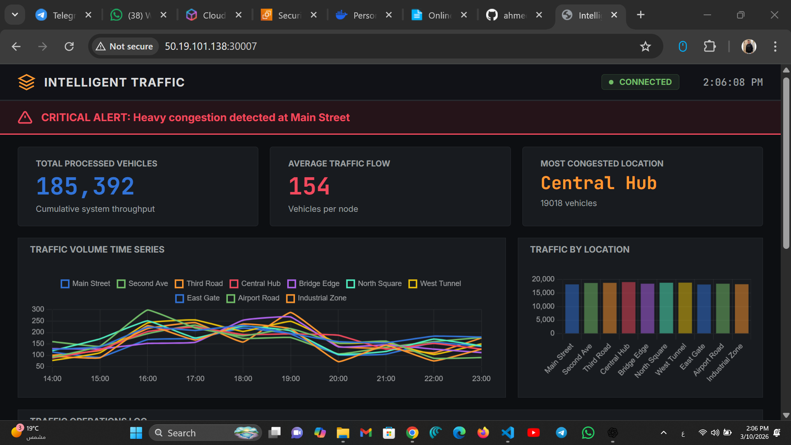

# 🚦 Intelligent Traffic Management DevOps Project

A complete DevOps-based traffic monitoring platform that simulates traffic sensor data, processes it through backend services, and visualizes traffic analytics in real time.

This project demonstrates a full DevOps workflow including infrastructure provisioning, containerization, CI/CD automation, Kubernetes orchestration, and monitoring.

---

# 🏗️ System Architecture

The following diagram illustrates the overall architecture of the system.

Workflow:

Developer → GitHub → Jenkins CI/CD → Docker → Kubernetes → Prometheus → Grafana

---

# ⚙️ Tech Stack

Backend: Python (FastAPI)

Frontend: HTML / CSS / JavaScript

Containerization: Docker

Orchestration: Kubernetes

CI/CD: Jenkins

Infrastructure as Code: Terraform

Configuration Management: Ansible

Monitoring: Prometheus & Grafana

Cloud Provider: AWS EC2

Reverse Proxy: Nginx

Version Control: Git & GitHub

---

# ⚙️ Setup & Running

Install dependencies:

cd services/traffic-api
pip install fastapi uvicorn

Start backend locally:

uvicorn main:app --reload --port 8000

Run with environment variable (optional):

$env:ENV="Staging"; uvicorn main:app --reload

Run dashboard:

Open the following file in your browser:

services/dashboard/index.html

---

# ☁️ Infrastructure Deployment

Provision infrastructure using Terraform:

cd terraform

terraform init
terraform plan
terraform apply

Terraform provisions the required infrastructure components such as EC2 instances and networking.

---

Configure servers using Ansible:

cd ansible

ansible-playbook setup.yml

Ansible automates:

Docker installation  
Nginx installation  
Git installation  
Server configuration  

---

Deploy application to Kubernetes:

cd kubernetes

kubectl apply -f .

---

Verify deployment:

kubectl get pods

kubectl get svc

You should see running services such as:

traffic-api  
traffic-dashboard  
nginx-proxy  

---

# 📊 Monitoring & Observability

Monitoring is implemented using Prometheus and Grafana.

Prometheus collects metrics from:

Traffic API  
Node Exporter  
System services  

---

Prometheus Targets Screenshot

Access Prometheus:

http://<server-ip>:9090

---

Grafana Dashboard

Grafana visualizes system and application metrics collected by Prometheus.

The dashboard shows:

CPU usage  
Memory consumption  
API request metrics  
Traffic analytics  

Access Grafana:

http://<server-ip>:3000

---

Traffic Monitoring Dashboard

The dashboard displays traffic congestion analytics and traffic flow metrics in real time.

Dashboard features:

Traffic congestion insights  
Vehicle processing metrics  
Traffic flow statistics  
Real-time analytics visualization  

---

# 🔄 CI/CD Pipeline

The CI/CD pipeline is implemented using Jenkins.

Pipeline workflow:

1 Pull source code from GitHub  
2 Build Docker images  
3 Push images to container registry  
4 Deploy to Kubernetes cluster  
5 Monitor services using Prometheus and Grafana  

This pipeline ensures automated, reliable, and scalable deployments.

---

# 📂 Project Structure

intelligent-traffic-devops

ansible  
kubernetes  
monitoring  
services  
terraform  

docs  
images  

README.md

---

# Conclusion

This project demonstrates the implementation of a complete DevOps workflow through building and deploying an Intelligent Traffic Management System.

The system simulates traffic data processing and provides real-time visualization through a traffic monitoring dashboard. The backend service was developed using FastAPI, while the frontend dashboard was built using lightweight web technologies including HTML, CSS, and JavaScript.

Throughout the development process, several DevOps practices were applied. The application services were containerized using Docker, automated builds and deployments were implemented using Jenkins CI/CD pipelines, and the services were orchestrated using Kubernetes for scalability and reliability.

Infrastructure provisioning was automated using Terraform, while server configuration and environment setup were managed using Ansible. In addition, monitoring and observability were implemented using Prometheus and Grafana to track system performance and service health.

The goal of this project was to simulate a real-world DevOps environment and demonstrate practical skills in building, deploying, and managing cloud-native applications using modern DevOps tools.

---

# 👨‍💻 Author

Ahmed Hamed

DevOps & Cloud Engineer

GitHub:
https://github.com/ahmed1707hamed-tech
